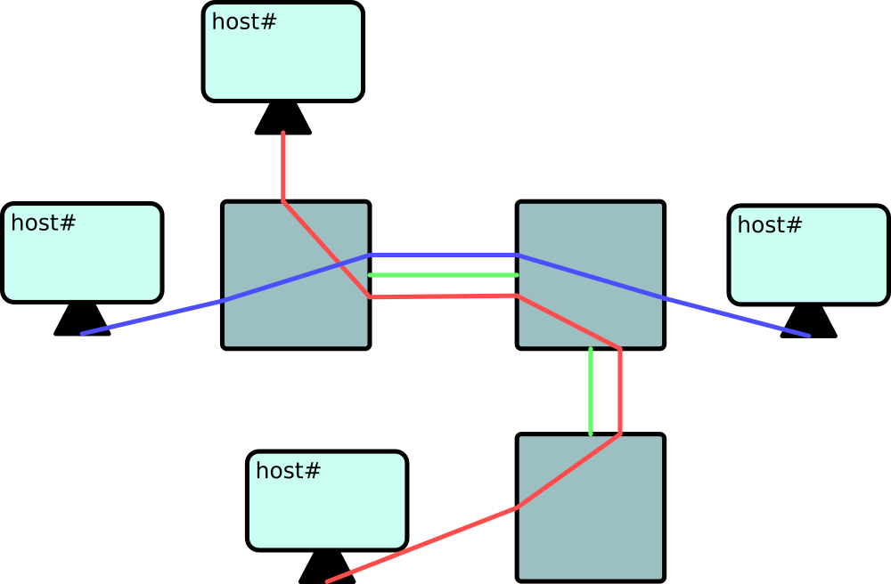
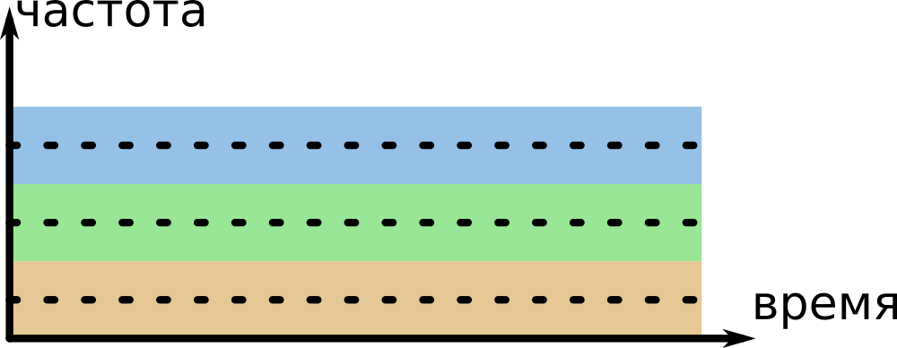
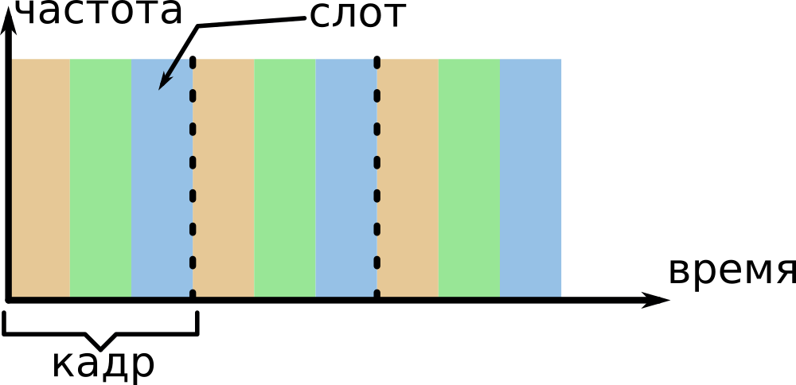

# ПетрГУ 2021. Билеты к экзамену по компьютерным сетям.
> &copy; MIT license. Никон Подгорный (@NikonP)
---

# 0. ВАЖНО
> PDU (Protocol data unit) - блок данных протокола. Одиночный блок информации, передаваемый между равноправными объектами компьютерной сети.

## Сетевая модель OSI (The Open Systems Interconnection model)
Описывает и стандартизует взаимодействие устройств в компьтерных сетях.

Уровни OSI (от высоких к низким):
- Прикладной (application) - высокоуровневые API (HTTP, FTP, POP3, WebSocket). **PDU - данные (сообщение)**
- Представления (presentation) - кодировки сиволов (UTF-8, ASCII, Base64), сжатие, шифрование **PDU - данные**
- Сеансовый (session) - управление сессиями (сеансами). Сессия - продолжительный обмен данными между двумя хостами. **PDU - данные**
- Транспортный (transport) - прямая связь между хостами (TCP, UDP). Поддерживает сегментацию, подтверждение корректости (ACK, NAK) и мультиплексирование (создание нескольких подканалов связи). **PDU - сегменты (есть соединение) или датаграммы (без соединения)**
- Сетевой (network) - Определение маршрута и логическая адресация (IPv4, IPv6). **PDU - пакеты**
- Канальный (data link) - Физическая адресация (Wi-Fi, Ethernet, DSL, PPP) **PDU - кадры (последовательность бит длиной n)**
- Физический (physical) - Работа со средой передачи, сигналами и двоичными данными (USB, I2C, витая пара) **PDU - биты**

## Стек протоколов Internet
Похоже на OSI:
- Прикладной

<!-- - Интернет с точки зрения составных частей: оконечная система, хост (end system, host)
- маршрутизатор (router, gateway)
- линия связи
- пропускная способность линии связи (bandwidth)
- задержка, вносимая линией свзяи (latency)
- маршрут (путь, route)
- пакет
- поставщик услуг Интернет (провайдер, ISP)
- протокол
- распредленные приложения
- Интернет с точки зрения предоставляемых услуг
- передача данных без установления соединения
- передача данных с установлением соединения -->
# 1. Компьютерные сети и Internet. Основные термины и определения.
Интернет — это компьютерная сеть, которая связывает между собой сотни миллионов вычислительных устройств по всему миру. Все устройства подключенный к Интернет называются конечными системами или хостами. 
> Если раньше хостами были в основном ПК и серверы, то сейчас это может быть любое устройство вполть до умной лампочки.

Хосты соединяются вместе при помощи сети линий свзяи и коммутаторов пакетов. Во время передачи данные сегментируются и формируют небольшие порции информации, называемые пакетами.
> Линии связи могуть быть разных типов, с разными физическими носителями (коаксиальный кабель, медный провод, оптоволокно и т.д.). 
Разные типы линий связи имеют разную скорость.

> Задержка (latency) - некоторая временная задержка обусловленная технологией передачи данных по линии свзяи.

> Пропускная способность (bandwidth) - максимальный объем данных который можно передать по линии связи за еденицу времени. Пропускная способность может отличаться для входящего и исходящего потока данных.

Коммутатор пакетов получает пакет по одной из своих входных линий связи и направляет его по одной из своих исходящих линий связи.

Конечные системы получают доступ к Интернету через поставщиков услуг Интернета, или Интернет-провайдеров (Internet Service Providers, ISP).

Интернет &mdash; это конечные системы, соединяемые друг с другом, поэтому предоставляющие к ним доступ организации должны быть соединены между собой.

> Протокол - некоторое соглашение, которое описывает как передаются, принимаются и обрабатываются данные.

Двумя самыми важными протоколами в Интернете являются протокол управления передачей (Transmission Control Protocol, TCP) и протокол Интернета (Internet Protocol, IP). В протоколе IP задается формат пакетов, которые передаются между маршрутизаторами и конечными системами. Совокупность (стек) основных протоколов Интернета известна как TCP/IP.

Интернет-стандарты разрабатываются инженерным советом Интернета (IETF, Internet Engineering Task Force). Документы стандартов называются рабочими предложениями (request for comments, RFC).

В других организациях также определяют стандарты для компонентов сетей, в особенности для сетевых линий связи. Например, комитетом по стандартам локальных и городских сетей (IEEE 802 LAN/MAN Standards Committee) разрабатываются стандарты по Ethernet, беспроводной связи Wi-Fi.

Интернет также можно рассматривать как инфраструктуру, которая предоставляет службы для приложений (электронная почта, социальные сети, обмен мгновенными сообщениями, etc).

> Распредленные приложения вовлекают в работу множество конечных систем, которые обмениваются данными друг с другом.
Интернет-приложения выполняются на конечных системах, а не на коммутаторах пакетов в ядре сети.

Конечные системы, подсоединенные к Интернету, предоставляют интерфейс программирования приложений (Application Programming Interface, API), который определяет, как программа, выполняющаяся на одной конечной системе, запрашивает инфраструктуру Интернета для доставки данных в конкретную целевую программу, выполняющуюся на другой конечной системе.

> TCP - передача данных с установлением соединения. Надежность доставки, регулирование скорости потока в случае перегрузок.

> UDP - передача данных без установления соединения. Не гарантируется надежность передачи, нет контроля перегрузок.

> Acknowledgment (ACK) - сигнал успеха передачи данных. Также существует противоположенность negative-acknowledgment (NAK).

## Сетевая модель OSI (The Open Systems Interconnection model)
Описывает и стандартизует взаимодействие устройств в компьтерных сетях.
> PDU (Protocol data unit) - блок данных протокола. Одиночный блок информации, передаваемый между равноправными объектами компьютерной сети.

Уровни OSI (от высоких к низким):
- Прикладной (application) - высокоуровневые API (HTTP, FTP, POP3, WebSocket)
- Представления (presentation) - кодировки сиволов (UTF-8, ASCII, Base64), сжатие, шифрование
- Сеансовый (session) - управление сессиями (сеансами). Сессия - продолжительный обмен данными между двумя хостами.
- Транспортный (transport) - прямая связь между хостами (TCP, UDP). Поддерживает сегментацию, подтверждение корректости (ACK, NAK) и мультиплексирование (создание нескольких подканалов связи).
- Сетевой (network) - Определение маршрута и логическая адресация (IPv4, IPv6). 
- Канальный (data link) - Физическая адресация (Wi-Fi, Ethernet, DSL, PPP)
- Физический (physical) - Работа со средой передачи, сигналами и двоичными данными (USB, I2C, витая пара)

---
<!-- 
- Определение протокола. Формат сообщений, порядок сообщений, действия, выполняемые при передаче и/или приеме сообщений или наступлении иных событий
- Пример с запросом времени
- Что произойдёт при нарушении требований протокола (пример)
- Пример запроса файла по HTTP
- Схематическое изображение протокола (две вертикальные линии, время сверху вниз)
 -->
# 2. Протокол (примеры)
Протокол - набор требований о формате и последовательности взаимодействия хостов.
Протокол может описывать как необходимо начинать и заканчивать обмен данными (сессию, сеанс), как поддерживать активность сессии, как обмениваться ключами и шифровать пакеты данных и т.п..
Пример с лекции:


Чтобы два хоста (две системы) могли корректно взаимодействаоть друг с другом, они должы работать с одним протоколом. Если протокол нарушен, то невозможно гарантровать правильную (или вообще какую-либо) работу системы.
> Пример: пусть есть два хоста на которых работает некоторое приложение-чат. 
Если одна один хост хочет начать чат с другим, то он отправляет HTTP запрос на эндпоинт `/connect`, в ответ хост получает JSON файл, в котором указан порт для отправки сообщений.
Допустим на одном из хосте обновили приложение и добавили простое шифрование, теперь в JSON файле возвращается не только порт, но и ключ шифрования AES которым надо шифровать все сообщения.
Протокол нарушен, теперь приложения разных версий не смогут правильно работать друг с другом.

Пример HTTP GET запроса (в конце каждой строки "\r\n"):
```http
GET /index.html HTTP/1.1
Host: ip:port *или host.com*
User-Agent: some-user-agent
...
Header: *data*
```
Пример HTTP POST запроса:
```http
POST /endpoint.php HTTP/1.1
Host: ip:port *или host.com*
User-Agent: some-user-agent
Content-Length: n
Content-Type: application/x-www-form-urlencoded
*тут пустая строка*
*n байт данных (тело запроса)*
```
Пример ответа (успех):
```http
HTTP/1.0 200 OK
Server: server-name
Date: Tue, 22 Jun 2021 15:47:11 GMT
Content-type: text/html; charset=utf-8
Content-Length: n
*тут пустая строка*
*n байт данных*
```
Пример ответа (ошибка):
```http
HTTP/1.0 404 File not found
Server: server-name
Date: Tue, 22 Jun 2021 15:47:11 GMT
Content-type: text/html; charset=utf-8
Connection: close
Content-Length: n
*тут пустая строка*
*n байт данных*
```

<!-- - оконечная система (end system, host), неформальное определение
- примеры оконечных систем (ПК, ноутбуки, PDA, различные девайсы IoT)
- переферия сети (network edge)
- клиент, сервер
- клиент потребляет услуги (сервисы), сервер предоставляет услуги
- услуга передачи данных с установлением логического соединения, время, которое требуется на передачу
- `T = Tc + S / R`, где `Tc = const` - время установления соединения, `S` - объем данных, `R` - пропускная способность
- Передача данных без установления логического соединения, `T = (S+h) / R`, где `h = const` - заголовок пакета
- что будет при маленьком `S` (единицы байт)
- что будет при большом `S` (несколько Гб) -->
# 3. Конечные системы, архитектура клиент-сервер, сервисы с установлением соединения и без установления соединения
Конечные системы также называются хостами, т.к. на них находятся (хостятся) прикладные программы (веб-браузеры, сервера, клиенты email).
Конечные системы можно разделить на две категории:
- Клиенты (ПК, ноутбуки, мобильные девайсы (ака PDA), устроуства IoT). Как правило персональное использование.
- Серверы. Хранение, обработка и рассылка данных (в том числе веб-страниц).
> ЦОД - центр обработки данных. В одном ЦОДе может находиться более сотни тысяч серверов.

> Сервер предоставляет некоторые услуги (информацию, вычислительную мощность, etc), а клиент использует эти услуги. 
Также сервера позволяют клиентам обмениваться информацией между собой (тут ещё можно сказать про белые/серые адреса и NAT)

Если данные передаются с установлением логического соединения (TCP), то время затраченное на передачу можно посчитать как `T = Tc + S / R`, где `Tc = const` - время установления соединения, `S` - объем данных, `R` - пропускная способность.

Если не происходит установления соединения (UDP), то время можно посчитать как `T = (S+h) / R`, где `h = const` - размер заголовка пакета.

> При очень маленьком `S` эффективнее не установливать соединение, т.к. время `Tc` может быть значительно больше `S/R`, а потеря пакетов минимальна.

> При большом `S` (несколько Гб) с одной стороны эффективнее не установливать соединение, т.к. тогда не будет тратиться время на подтверждение пакетов, но с другой стороны, при большом объеме данных, высока вероятность потери пакетов, поэтому лучше установить логическое соединение. Передача больших объемов данных без установления соединения может быть использована при трансляции видео/аудио/etc контента. 

<!-- 
- конечные системы, маршрутизаторы, каналы связи
- ядро сети (network core)
- коммутация каналов, типичная структура сети с коммутацией каналов (схема: узлы, узлы соеденеы линиями, каждая линия - n каналов)
- деление на каналы: FDM, TDM, CDMA
- коммутация пакетов
- действия маршрутизатора
- сравнение коммутации пакетов и коммутации каналов
- сегментирование сообщений
- пример с временем передачи даннных в системе с двумя маршрутизаторами без деления сообщения на пакеты и с делением на пакеты
 -->
# 4. Коммутация каналов, коммутация пакетов, коммутация сообщений, маршрутизация
Конечные устройства (хосты) объеденены в сеть при помощи линий связи. Между хостами находятся маршрутизаторы, которые распределяют поток данных и контролируют адресацию пакетов.

> Маршрутизатор - специальное устройство сетевого уровня модели `OSI`, которое пересылает пакеты между различными сегментами сети на основе заданных правил.

> Ядро сети - набор коммутаторов пакетов и каналов связи, которые взаимодействуют с конечными системами Интернета. А также сети сетей.

## Коммутация пакетов
Данные разбиваются на части - "пакеты". У каждого пакета есть заголовок, в котором указан адрес получателя и прочая информация (например номер пакета). Сеть маршрутизаторов пернаправляет пакеты  до хоста-получателя. Пакеты передаются независимо друг от друга.

## Коммутация каналов
Между хостами и коммутаторами есть раличное число "каналов", при соединении 2х хостов, временно резервируются ресурсы (каналы).
> Если линия свзязи коммутатора имеет скорость 2Мбит/c, а коммутатор имеет 4 канала, то скорость каждого канала будет равна 500Кбит/c (пропускная способность каналов получается разбиением пропускной скорости линии).



> Мультиплексирование - передача нескольких потоков данных по одной линии связи, т.е. создание нескольких каналов.
- FDM. Мультиплексирование с разделением по частоте - спектор всей линии разделяется между каналами по частоте:



- TDM. Мультиплексирование с разделением по времени - время разделяется на фиксированные промежутки "кадры". Кадры разделяются на фиксированное число "слотов"



- CDMA. Множественный доступ с кодовым разделением - технология основана на операции XOR, хосты по некоторому коду (числовому значению) извлекают из общего потока данных принадлежащием им части. Используется в мобильной связи.

## Действия маршрутизатора
- Получить пакет
- Определить куда перенаправить
- Отправить пакет

## Сравнение коммутации пакетов и коммутации каналов
| Коммутация пакетов                | Коммутация каналов                                    |
|-----------------------------------|-------------------------------------------------------|
| Случайные задержки                | Трафик реального врмени без задержек (стрим контента) |
| Сеть всегда позволяет соединения  | Сеть может отказать в соединении                      |
| Пропускная способность неизвестна | Гарантированная пропускная способность                |
| Адрес в заголовке каждого пакета  | Адрес используется только при установлении соединения |

## Cегментирование сообщений
Если передавать данные не разделяя его на пакеты, то "маршрутизатор 1" не сможет отправить из дальше пока не полуичт целиком, соответственно общее время `T = T1 + T2 + T3`.

Эффективнее передавать данные по маленьким пакетам. По сути, передача данных без сегментирования - это последовательная передача, а с сегментированием - параллельная.


<!-- 
- Резидентный доступ
- модем, типичная пропускная способность
- (A)DSL, типичная пропускная способность
- Корпоративный доступ
- Ethernet (10-100-1000)
- Мобильный доступ
- IEEE 802.11b/g (Wi-Fi), пропускная способность
- GPRS, пропускная способность, большая задержка
- Физические среды: 
    - медная витая пара
    - коаксиальный кабель
    - оптоволокно
    - территориальные радиоканалы
    - спутники радиоканалы
    - другие
 -->
# 5. Сети доступа и среды передачи данных
Конечные системы получают доступ к Интернету через поставщиков услуг Интернета, или Интернет-провайдеров (ISP):
- Резидентный доступ (по месту жительства)
- Корпоративный доступ
- etc (университетский интернет, Wi-Fi в кафешках)

## Корпоративный доступ
- Локальная сеть - LAN
- Маршрутизатор организации

## Модем (dial-up)
Модем преобразует аналоговый сигнал телефонной линии в цифровой. Интернет услуги предоставляет телефонная компания.
- Обычно около 56 kbit/s
- Задержка - до 400ms

## xDSL
xDSL - digital subscriber line, цифровая абонентская линия. 
`x` - название конкретной технологии, например ADSL. В отличии от dial-up используется другой диапазон частот. Также сигнал передаётся только до АТС (автоматическая телефонная станция).

### ADSL

ADSL - Asymmetric Digital Subscriber Line - асимметричная цифровая абонентская линия. Полоса пропускания канала распределена между исходящим и входящим трафиком асимметрично. Так как у большинства пользователей объём входящего трафика значительно превышает объём исходящего, то скорость исходящего трафика значительно ниже.

- 1.5-12 Mbit/s для входящего трафика, 0.5-1.8 Mbit/s для исходящего
- Задержка - около 40ms

## Ethernet (10/100/1000)
Ethernet - семейство технологий пакетной передачи данных между устройствами. 
- определяет проводные соединения и электрические сигналы на физическом уровне
- определяет формат кадров и протоколы управления доступом к среде на канальном уровне

Изначально коаксиальный кабель, потом витая пара и оптоволокно.
> Задержка - 1-10ms
> Маркируется по скорости 10/100/1000 Mbit/s

Преимущества витой пары по сравнению с коаксиальным кабелем: 
- возможность работы в дуплексном режиме
- низкая стоимость
- более высокая надёжность сетей
- большая помехоустойчивость
- PoE

## Мобильный доступ
### 3, 4, 5G
Опрератор предоставляет доступ через точки доступа. Радиус - десятки км. от точки доступа.
Пропускная способность:
- 3G - десятки Mbit/s
- 4G - сотни Mbit/s
- 5G - тысячи Mbit/s (несколько Gbit/s)

### GPRS
При использовании GPRS информация собирается в пакеты и передаётся через неиспользуемые в данный момент голосовые каналы. Что именно является приоритетом передачи - голосовой трафик или передача данных - выбирается оператором связи. 
- Максимальная пропускная способность 171,2 кбит/c
- Задержка несколько сотен мс

## Wi-Fi
WLAN - беспроводная локальная сеть.
- 802.11b - 11 Mbit/s
- 802.11g - 54 Mbit/s

<!-- 
- задержка узловой обработки
- задержка ожидания
- задержка передачи
- задержка распространения
- зависимость средней задержки ожидания от интесивности трафика `(L*a)/R`, где `L` - средняя длина пакета в битах, `a` - средняя частота получения пакетов, `R` - пропускная способность исходящей линии связи
- потеря пакетов как соедствие заполнения входного буфера маршрутизатора (из-за большой задержки ожидания, слишком много пакетов)
- общая задержка - сумма задержек обработки, ожидания, передачи и распространения
- утилиты `ping` и `traceroute`
 -->
# 6. Причины задержек и потерь в сетях с коммутацией пакетов
## Виды задержек
- задержка обработки (`d_обр`)
    - проверка заголовка пакета, определение маршрута
    - проверка ошибок из-за искажения битов
    - несколько микросекунд
- задержка очереди (`d_ожид`)
    - зависит от количества пакетов в очереди ожидания
    - зависит от уровня загрузки (трафика) маршрутизатора
- задержка передачи (`d_пер`)
    - `L` - длина пакета (бит)
    - `R` - скорость передачи по линии (бит/c)
    - `d_пер = L/R`
- задержка распространения (`d_распр`) - задержка физического сигнала (например радиоволны)
    - `d` - длина физической линии связи
    - `s` - скорость распространения (`~2 * 10^8` м/сек)

> `d_пер` и `d_распр` сильно отличаются

Общая задержка `d = d_обр + d_ожид + d_пер + d_распр`

> **Пример с дорогой и пунктами оплаты**

## Задержка ожидания и потеря пакетов
- `a` - средняя скорость прибытия пакетов в очередь (пакет/с)
- `L` - длина пакета (бит)
- `R` - скорость передачи по линии связи (бит/c)
- средняя задержка ожидания `d_avg = (L * a) / R = (скорость поступления битов) / (скорость обслуживания битов)` - интенсивность трафика
> `d_avg = 0` - низкая задержка
> `d_avg > 1` - прибывает больше, чем может быть обслужено. Средняя задержка бесконечна.
> `d_avg <= 1` - большая задержка ожидания

## Потеря пакетов
Буфер маршрутизатора заполнен => негде хранить пакет => маршрутизатор отбрасывает пакет => потеря пакета

## traceroute
Утилита traceroute измеряет задержки на пути источник-приемник. Для всех маршрутизаторов на пути.

## ping
Измерение RTT.
> RTT - round-trip time - круговая задержка - задержка между двумя точками

<!-- 
- пример многоуровневой системы
- уровни протоколов, для чего понадобилось делить на уровни
- единица обмена PDU
- обобщенные пример передачи сообщения (от высокого уровня к низкому, потом обратно)
- стек протоколов интернет. 5 уровней (прикладной, транспортный, сетевой, канальный, физический)
- PDU для каждого уровня
 -->
# 7. Уровни протоколов, стек протоколов Internet. Иерархия ISP.
Так значит, тут TODO, я дальше пока не расписываю, просто читаю конспекты. + добавлю всякую важную инфу.

