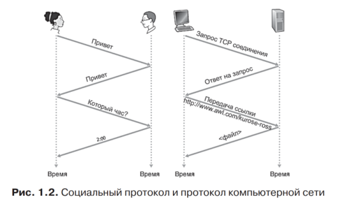

# ПетрГУ 2021. Билеты к экзамену по компьютерным сетям.
> &copy; MIT license. Никон Подгорный (@NikonP)
---

<!-- - Интернет с точки зрения составных частей: оконечная система, хост (end system, host)
- маршрутизатор (router, gateway)
- линия связи
- пропускная способность линии связи (bandwidth)
- задержка, вносимая линией свзяи (latency)
- маршрут (путь, route)
- пакет
- поставщик услуг Интернет (провайдер, ISP)
- протокол
- распредленные приложения
- Интернет с точки зрения предоставляемых услуг
- передача данных без установления соединения
- передача данных с установлением соединения -->
# 1. Компьютерные сети и Internet. Основные термины и определения.
Интернет — это компьютерная сеть, которая связывает между собой сотни миллионов вычислительных устройств по всему миру. Все устройства подключенный к Интернет называются конечными системами или хостами. 
> Если раньше хостами были в основном ПК и серверы, то сейчас это может быть любое устройство вполть до умной лампочки.

Хосты соединяются вместе при помощи сети линий свзяи и коммутаторов пакетов. Во время передачи данные сегментируются и формируют небольшие порции информации, называемые пакетами.
> Линии связи могуть быть разных типов, с разными физическими носителями (коаксиальный кабель, медный провод, оптоволокно и т.д.). 
Разные типы линий связи имеют разную скорость.

> Задержка (latency) - некоторая временная задержка обусловленная технологией передачи данных по линии свзяи.

> Пропускная способность (bandwidth) - максимальный объем данных который можно передать по линии связи за еденицу времени. Пропускная способность может отличаться для входящего и исходящего потока данных.

Коммутатор пакетов получает пакет по одной из своих входных линий связи и направляет его по одной из своих исходящих линий связи.

Конечные системы получают доступ к Интернету через поставщиков услуг Интернета, или Интернет-провайдеров (Internet Service Providers, ISP).

Интернет &mdash; это конечные системы, соединяемые друг с другом, поэтому предоставляющие к ним доступ организации должны быть соединены между собой.

> Протокол - некоторое соглашение, которое описывает как передаются, принимаются и обрабатываются данные.

Двумя самыми важными протоколами в Интернете являются протокол управления передачей (Transmission Control Protocol, TCP) и протокол Интернета (Internet Protocol, IP). В протоколе IP задается формат пакетов, которые передаются между маршрутизаторами и конечными системами. Совокупность (стек) основных протоколов Интернета известна как TCP/IP.

Интернет-стандарты разрабатываются инженерным советом Интернета (IETF, Internet Engineering Task Force). Документы стандартов называются рабочими предложениями (request for comments, RFC).

В других организациях также определяют стандарты для компонентов сетей, в особенности для сетевых линий связи. Например, комитетом по стандартам локальных и городских сетей (IEEE 802 LAN/MAN Standards Committee) разрабатываются стандарты по Ethernet, беспроводной связи Wi-Fi.

Интернет также можно рассматривать как инфраструктуру, которая предоставляет службы для приложений (электронная почта, социальные сети, обмен мгновенными сообщениями, etc).

> Распредленные приложения вовлекают в работу множество конечных систем, которые обмениваются данными друг с другом.
Интернет-приложения выполняются на конечных системах, а не на коммутаторах пакетов в ядре сети.

Конечные системы, подсоединенные к Интернету, предоставляют интерфейс программирования приложений (Application Programming Interface, API), который определяет, как программа, выполняющаяся на одной конечной системе, запрашивает инфраструктуру Интернета для доставки данных в конкретную целевую программу, выполняющуюся на другой конечной системе.

> TCP - передача данных с установлением соединения. Надежность доставки, регулирование скорости потока в случае перегрузок.

> UDP - передача данных без установления соединения. Не гарантируется надежность передачи, нет контроля перегрузок.

> Acknowledgment (ACK) - сигнал успеха передачи данных. Также существует противоположенность negative-acknowledgment (NAK).

## Сетевая модель OSI (The Open Systems Interconnection model)
Описывает и стандартизует взаимодействие устройств в компьтерных сетях.
> PDU (Protocol data unit) - блок данных протокола. Одиночный блок информации, передаваемый между равноправными объектами компьютерной сети.

Уровни OSI (от высоких к низким):
- Прикладной (application) - высокоуровневые API (HTTP, FTP, POP3, WebSocket)
- Представления (presentation) - кодировки сиволов (UTF-8, ASCII, Base64), сжатие, шифрование
- Сеансовый (session) - управление сессиями (сеансами). Сессия - продолжительный обмен данными между двумя хостами.
- Транспортный (transport) - прямая связь между хостами (TCP, UDP). Поддерживает сегментацию, подтверждение корректости (ACK, NAK) и мультиплексирование (создание нескольких подканалов связи).
- Сетевой (network) - Определение маршрута и логическая адресация (IPv4, IPv6). 
- Канальный (data link) - Физическая адресация (Wi-Fi, Ethernet, DSL, PPP)
- Физический (physical) - Работа со средой передачи, сигналами и двоичными данными (USB, I2C, витая пара)

---
<!-- 
- Определение протокола. Формат сообщений, порядок сообщений, действия, выполняемые при передаче и/или приеме сообщений или наступлении иных событий
- Пример с запросом времени
- Что произойдёт при нарушении требований протокола (пример)
- Пример запроса файла по HTTP
- Схематическое изображение протокола (две вертикальные линии, время сверху вниз)
 -->
# 2. Протокол (примеры)
Протокол - набор требований о формате и последовательности взаимодействия хостов.
Протокол может описывать как необходимо начинать и заканчивать обмен данными (сессию, сеанс), как поддерживать активность сессии, как обмениваться ключами и шифровать пакеты данных и т.п..
Пример с лекции:



Чтобы два хоста (две системы) могли корректно взаимодействаоть друг с другом, они должы работать с одним протоколом. Если протокол нарушен, то невозможно гарантровать правильную (или вообще какую-либо) работу системы.
> Пример: пусть есть два хоста на которых работает некоторое приложение-чат. 
Если одна один хост хочет начать чат с другим, то он отправляет HTTP запрос на эндпоинт `/connect`, в ответ хост получает JSON файл, в котором указан порт для отправки сообщений.
Допустим на одном из хосте обновили приложение и добавили простое шифрование, теперь в JSON файле возвращается не только порт, но и ключ шифрования AES которым надо шифровать все сообщения.
Протокол нарушен, теперь приложения разных версий не смогут правильно работать друг с другом.

Пример HTTP GET запроса (в конце каждой строки "\r\n"):
```http
GET /index.html HTTP/1.1
Host: ip:port *или host.com*
User-Agent: some-user-agent
...
Header: *data*
```
Пример HTTP POST запроса:
```http
POST /endpoint.php HTTP/1.1
Host: ip:port *или host.com*
User-Agent: some-user-agent
Content-Length: n
Content-Type: application/x-www-form-urlencoded
*тут пустая строка*
*n байт данных (тело запроса)*
```
Пример ответа (успех):
```http
HTTP/1.0 200 OK
Server: server-name
Date: Tue, 22 Jun 2021 15:47:11 GMT
Content-type: text/html; charset=utf-8
Content-Length: n
*тут пустая строка*
*n байт данных*
```
Пример ответа (ошибка):
```http
HTTP/1.0 404 File not found
Server: server-name
Date: Tue, 22 Jun 2021 15:47:11 GMT
Content-type: text/html; charset=utf-8
Connection: close
Content-Length: n
*тут пустая строка*
*n байт данных*
```

---